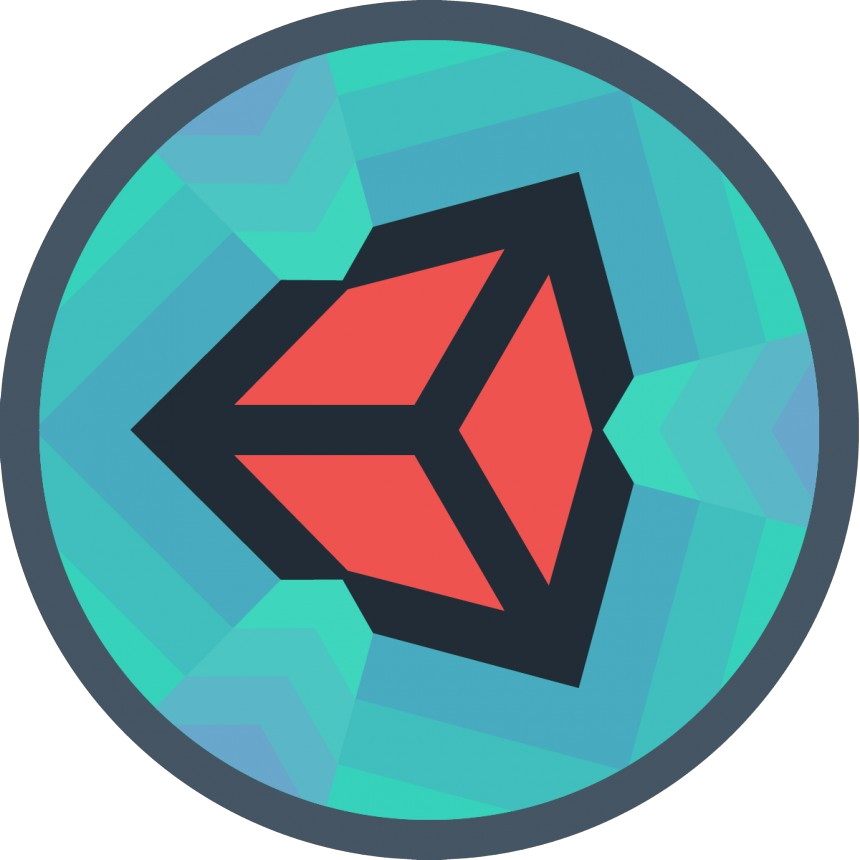

<h1 align="center"> Hello There! I am Saavya Awasthi </h1>  

    
  
  
<ul>
  <li> <h3 align="left"> <i><b> </b></i> </h3> </li>  
  <li> <h3 align="left"> <i><b> </b></i> </h3> </li>  
  <li> <h3 align="left"> <i><b> </b></i> </h3> </li>  
  <li> <h3 align="left"> <i><b> </b></i> </h3> </li>  
  <li> <h3 align="left"> <i><b> </b></i> </h3> </li>    
  
</ul>
  

 
    
   
    
   
        
    
   
    
   
       </a> 
   
    
   
   
    

<h1 align = "right">
   
 Technologies I know and wish to learn 

 </h1>
    
   
    
    
    
   
    
    
    
    
    
    
    
    
    
   
   
    
 
  

<h1 align = "center" > Contact Me: </h1>

  
 
   
   
  
  
   
  

   
  
   

